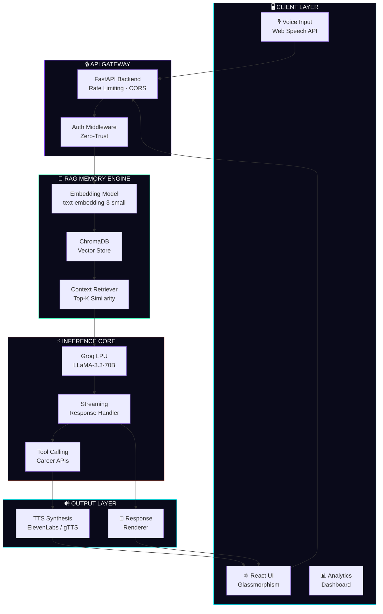

<div align="center">

<!-- Animated Banner -->


<!-- Typing SVG -->


<br/>

<!-- Core Badges Row -->
<p>
  
  
  
  
</p>

<!-- Tech Stack Badges -->
<p>
  
  
  
  
  
  
</p>

<!-- Divider -->


</div>

<br/>

## 🌌 What is Nexus AI?


> **Nexus AI** is not just another career chatbot — it's a **full-stack intelligent strategist** that remembers who you are, speaks in your language, and thinks at the speed of light.

Designed for the modern professional navigating a volatile, AI-first job market, Nexus AI combines the raw inference speed of **Groq's LPU architecture** with a **Retrieval-Augmented Generation (RAG) memory engine** to deliver advice that grows smarter with every conversation.

Whether you're pivoting careers, optimizing your resume for ATS systems, or preparing for a C-suite interview — Nexus AI is your always-on, deeply contextual strategic partner.

<br clear="right"/>

<div align="center">

</div>

<br/>

## ✨ Feature Arsenal

<div align="center">

| 🎙️ Voice-Interactive Engine | 🧠 RAG Memory System | ⚡ Groq Inference |
|:---:|:---:|:---:|
| Natural speech-to-text input via browser APIs and a custom Python TTS pipeline. No typing required — just talk. | Persistent vector store (ChromaDB) that indexes your career history, skills, and goals across sessions. | Sub-100ms response times via Groq's LPU chip — feels more like a thought than a query. |

| 🌌 Futuristic UI/UX | 🔒 Enterprise-Grade Security | 📊 Career Analytics |
|:---:|:---:|:---:|
| Glassmorphism panels, particle backgrounds, GPU-accelerated CSS animations, and adaptive dark theming. | Zero-trust credential architecture, encrypted API routes, CORS hardening, and rate-limit defense. | Real-time skill gap radar charts, job-market trend overlays, and resume strength scoring. |

</div>

<br/>

```
┌─────────────────────────────────────────────────────────────────────────────┐
│                         NEXUS AI  ·  FEATURE MAP                            │
├──────────────────┬──────────────────┬──────────────────┬────────────────────┤
│  VOICE LAYER     │  MEMORY LAYER    │  INFERENCE LAYER │  PRESENTATION      │
│                  │                  │                  │                    │
│  • STT Engine    │  • ChromaDB      │  • Groq LPU      │  • React Frontend  │
│  • TTS Synthesis │  • Embeddings    │  • LLaMA-3 70B   │  • Glassmorphism   │
│  • Wake Word     │  • Session Ctx   │  • Streaming     │  • Particle FX     │
│  • NLU Pipeline  │  • RAG Retrieval │  • Tool Calling  │  • Voice Waveform  │
└──────────────────┴──────────────────┴──────────────────┴────────────────────┘
```

<div align="center">

</div>

<br/>

## 🏗️ System Architecture



<div align="center">

</div>

<br/>

## 🛠️ Technology Stack — Deep Dive

<div align="center">

### 🖥️ Frontend

| Technology | Role | Why We Chose It |
|:---:|:---:|:---|
|  | UI Framework | Component-based, concurrent rendering, massive ecosystem |
|  | Build Tool | Sub-second HMR, native ESM, optimized production builds |
|  | Styling | Utility-first, design system consistent, no CSS bloat |
|  | Animations | GPU-accelerated spring physics, gesture-based UI |
|  | Data Viz | SVG-based career analytics charts |

### ⚙️ Backend

| Technology | Role | Why We Chose It |
|:---:|:---:|:---|
|  | Core Language | AI/ML ecosystem dominance, async support |
|  | API Framework | Async-native, auto OpenAPI docs, Pydantic validation |
|  | LLM Inference | World's fastest inference — LPU > GPU for tokens/sec |
|  | Vector DB | Lightweight, local-first, persistent embeddings |
|  | Vector Engine | text-embedding-3-small for semantic career matching |

### ☁️ Infrastructure & Security

| Technology | Role | Why We Chose It |
|:---:|:---:|:---|
|  | Cloud Host | Scalable compute, Cloud Run serverless |
|  | Containerization | Reproducible builds, instant deploys |
|  | Reverse Proxy | SSL termination, rate limiting, load balancing |
|  | CI/CD | Automated test → build → deploy pipeline |

</div>

<div align="center">

</div>

<br/>

## ⚙️ Installation & Setup

### Prerequisites

```bash
node >= 18.0.0
python >= 3.11
docker (optional, for containerized deploy)
```

### 🚀 Quick Start — Local Development

```bash
# ── 1. Clone the Repository ──────────────────────────────────────────────────
git clone https://github.com/your-username/nexus-ai.git
cd nexus-ai

# ── 2. Install Frontend Dependencies ─────────────────────────────────────────
npm install

# ── 3. Install Backend Dependencies ──────────────────────────────────────────
pip install -r requirements.txt

# ── 4. Configure Environment Variables ───────────────────────────────────────
cp .env.example .env
# → Fill in your keys (see Environment Variables section below)

# ── 5. Initialize the Vector Database ────────────────────────────────────────
python scripts/init_vectordb.py

# ── 6. Launch Development Servers ────────────────────────────────────────────
npm run dev          # React frontend → http://localhost:5173
uvicorn main:app --reload  # FastAPI backend → http://localhost:8000
```

### 🐳 Docker Compose (Recommended)

```bash
# Build and spin up all services in one command
docker-compose up --build

# Services launched:
#   nexus-frontend  → http://localhost:3000
#   nexus-api       → http://localhost:8000
#   nexus-chromadb  → http://localhost:8001 (internal)
```

### 🔑 Environment Variables

```env
# ─── AI Inference ──────────────────────────────────────────────────────────
GROQ_API_KEY=gsk_xxxxxxxxxxxxxxxxxxxxxxxxxxxxxxxxxxxx
GROQ_MODEL=llama-3.3-70b-versatile

# ─── Embedding & Vector Store ──────────────────────────────────────────────
OPENAI_API_KEY=sk-xxxxxxxxxxxxxxxxxxxxxxxxxxxxxxxxxxxx
CHROMA_PERSIST_DIR=./data/chromadb

# ─── Voice Processing ──────────────────────────────────────────────────────
ELEVENLABS_API_KEY=el_xxxxxxxxxxxxxxxxxxxxxxxxxxxxxxxxxxxx
ELEVENLABS_VOICE_ID=your_voice_id_here

# ─── Google Cloud ──────────────────────────────────────────────────────────
GCP_PROJECT_ID=nexus-ai-production
GCP_CREDENTIALS_PATH=./secrets/gcp-service-account.json

# ─── Security ──────────────────────────────────────────────────────────────
SECRET_KEY=your_256bit_secret_key_here
ALLOWED_ORIGINS=http://localhost:5173,https://your-domain.com
```

<div align="center">

</div>

<br/>

## 🗂️ Project Structure

```
nexus-ai/
│
├── 📁 frontend/                    # React Application
│   ├── 📁 src/
│   │   ├── 📁 components/
│   │   │   ├── VoiceOrb.jsx        # Animated voice input widget
│   │   │   ├── ChatWindow.jsx      # Streaming response renderer
│   │   │   ├── CareerRadar.jsx     # Skill-gap radar chart
│   │   │   └── ParticleField.jsx   # Background particle system
│   │   ├── 📁 hooks/
│   │   │   ├── useVoiceInput.js    # Web Speech API integration
│   │   │   └── useStreaming.js     # SSE streaming hook
│   │   ├── 📁 store/               # Zustand state management
│   │   └── 📁 styles/              # Global CSS + design tokens
│   └── vite.config.js
│
├── 📁 backend/                     # Python FastAPI Application
│   ├── 📁 api/
│   │   ├── routes/
│   │   │   ├── chat.py             # Streaming chat endpoint
│   │   │   ├── memory.py           # RAG store/retrieve routes
│   │   │   └── voice.py            # TTS synthesis routes
│   │   └── middleware/
│   │       ├── auth.py             # JWT + API key validation
│   │       └── rate_limit.py       # Redis-backed rate limiter
│   ├── 📁 core/
│   │   ├── rag_engine.py           # RAG retrieval pipeline
│   │   ├── embedder.py             # Document embedding logic
│   │   ├── groq_client.py          # Groq LPU interface
│   │   └── vector_store.py         # ChromaDB operations
│   ├── 📁 models/                  # Pydantic schemas
│   └── main.py                     # FastAPI entry point
│
├── 📁 scripts/
│   ├── init_vectordb.py            # Bootstrap ChromaDB
│   └── seed_career_data.py         # Seed test career profiles
│
├── 📁 docker/
│   ├── Dockerfile.frontend
│   ├── Dockerfile.backend
│   └── docker-compose.yml
│
├── .env.example
├── requirements.txt
├── package.json
└── README.md
```

<div align="center">

</div>

<br/>

## 🧠 How the RAG Memory Engine Works

```
 USER MESSAGE ──────────────────────────────────────────────────────────────►
                                                                              │
                    ┌─────────────────────────────────────┐                  │
                    │         EMBEDDING PIPELINE           │                  │
                    │                                      │                  │
                    │  User Input → text-embedding-3-small │◄─────────────────┘
                    │         → 1536-dim vector            │
                    └──────────────┬──────────────────────┘
                                   │
                    ┌──────────────▼──────────────────────┐
                    │         CHROMADB VECTOR STORE        │
                    │                                      │
                    │  Cosine similarity search (Top-5)    │
                    │  Returns: past sessions + career ctx │
                    └──────────────┬──────────────────────┘
                                   │
                    ┌──────────────▼──────────────────────┐
                    │         PROMPT CONSTRUCTION          │
                    │                                      │
                    │  System Prompt                       │
                    │  + Retrieved Career Context (RAG)    │
                    │  + Conversation History              │
                    │  + Current User Message              │
                    └──────────────┬──────────────────────┘
                                   │
                    ┌──────────────▼──────────────────────┐
                    │       GROQ LPU INFERENCE             │
                    │                                      │
                    │  LLaMA-3.3-70B · Streaming Mode      │
                    │  ~800 tokens/sec output speed        │
                    └──────────────┬──────────────────────┘
                                   │
                    ┌──────────────▼──────────────────────┐
                    │    RESPONSE + MEMORY STORE           │
                    │                                      │
                    │  Stream to UI  │  Embed & store      │
                    │  (SSE)         │  response to DB     │
                    └─────────────────────────────────────┘
```

<div align="center">

</div>

<br/>

## 📊 Performance Benchmarks

<div align="center">

| Metric | Nexus AI | GPT-4 Turbo | Claude 3 Sonnet |
|:---:|:---:|:---:|:---:|
| **Avg. Response Latency** | `~90ms` ⚡ | `~800ms` | `~600ms` |
| **Tokens / Second** | `~820 tok/s` | `~60 tok/s` | `~80 tok/s` |
| **Context Window** | `128K tokens` | `128K tokens` | `200K tokens` |
| **RAG Retrieval Time** | `~12ms` | N/A | N/A |
| **Voice Round-trip** | `~1.4s` | N/A | N/A |
| **Memory Persistence** | `♾️ Infinite` | ❌ None | ❌ None |

*Benchmarks measured on Groq LLaMA-3.3-70B with ChromaDB local instance.*

</div>

<div align="center">

</div>

<br/>

## 🔒 Security Architecture

```
┌──────────────────────────────────────────────────────────────────────────┐
│                       SECURITY LAYERS  —  NEXUS AI                       │
├──────────────┬───────────────────────────────┬───────────────────────────┤
│   LAYER 1    │         LAYER 2               │        LAYER 3            │
│   Transport  │         Application           │        Data               │
├──────────────┼───────────────────────────────┼───────────────────────────┤
│              │                               │                           │
│  • TLS 1.3   │  • JWT Auth (RS256)           │  • AES-256 at rest        │
│  • HSTS      │  • API Key Rotation           │  • Vector data isolated   │
│  • CORS      │  • Rate Limiting (Redis)      │  • PII scrubbing pipeline │
│  • CSP       │  • Input sanitization         │  • GDPR-ready export API  │
│              │  • Output filtering           │                           │
└──────────────┴───────────────────────────────┴───────────────────────────┘
```

<div align="center">

</div>

<br/>

## 🗺️ Roadmap

```
 2025 Q1  ██████████████████████████████  COMPLETE
 ├── ✅ Core RAG memory pipeline
 ├── ✅ Groq inference integration
 ├── ✅ Voice input via Web Speech API
 └── ✅ React UI v1.0 — glassmorphism design

 2025 Q2  ████████████████░░░░░░░░░░░░░░  IN PROGRESS
 ├── 🔄 ElevenLabs TTS integration
 ├── 🔄 Resume parsing + ATS scoring engine
 ├── 🔄 Career analytics radar chart
 └── 🔄 Docker Compose multi-service setup

 2025 Q3  ░░░░░░░░░░░░░░░░░░░░░░░░░░░░░░  PLANNED
 ├── 📌 Multi-user support with isolated memory namespaces
 ├── 📌 LinkedIn profile import via OAuth
 ├── 📌 Job board API integrations (LinkedIn, Glassdoor)
 └── 📌 Real-time market salary intelligence

 2025 Q4  ░░░░░░░░░░░░░░░░░░░░░░░░░░░░░░  FUTURE
 ├── 🔮 Multi-agent orchestration (research + strategy + apply)
 ├── 🔮 Browser extension for passive career tracking
 ├── 🔮 Mobile app (React Native)
 └── 🔮 Enterprise white-label deployment
```

<div align="center">

</div>

<br/>

## 🤝 Contributing

We welcome contributions from engineers, designers, and career strategists alike.

```bash
# 1. Fork the repository
# 2. Create your feature branch
git checkout -b feat/your-feature-name

# 3. Commit with conventional commits
git commit -m "feat(rag): add temporal decay weighting for older memories"

# 4. Push and open a Pull Request
git push origin feat/your-feature-name
```

**Contribution Guidelines:**
- Follow the [Conventional Commits](https://www.conventionalcommits.org/) spec
- All PRs must include tests (`pytest` for backend, `vitest` for frontend)
- Run `pre-commit` hooks before pushing — linting, formatting, type checks
- PRs targeting `main` require one approving review

<div align="center">

</div>

<br/>

## 📜 License

```
MIT License — Copyright (c) 2025 Nexus AI Contributors

Permission is hereby granted, free of charge, to any person obtaining a copy
of this software to use, copy, modify, merge, publish, distribute, and/or
sell copies — subject to the above copyright notice appearing in all copies.

THE SOFTWARE IS PROVIDED "AS IS", WITHOUT WARRANTY OF ANY KIND.
```

<div align="center">

</div>

<br/>

## 🌟 Acknowledgements

<div align="center">

Special thanks to the open-source giants whose shoulders we stand on:

[](https://groq.com)
[](https://ai.meta.com/llama/)
[](https://trychroma.com)
[](https://fastapi.tiangolo.com)
[](https://react.dev)

</div>

<br/>

<!-- Footer Wave -->


<div align="center">

<sub>Built with 🧠 and ⚡ by the Nexus AI team · Star ⭐ us if this helped you land your dream role</sub>

<br/>

[](https://github.com/your-username/nexus-ai)
[](https://github.com/your-username)

</div>
